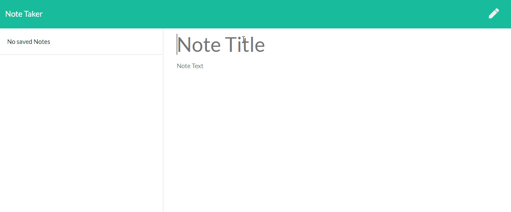

# Note Taker  
This application can be used to write, save, and delete notes. It uses an express backend and saves and retrieves note data from a JSON file. 

<p align="center">
    
</p>

## Table of Contents:
* [Installation](#installation)
* [Usage](#usage)
* [License](#license)
* [Contributing](#contributing)
* [Tests](#tests)
* [Questions](#questions)
### Installation:
In order to install the necessary dependencies, open the console and run the following:
```npm install```
### Usage:
The notes are saved virtually. No note data is actually saved in the local JSON db (database) file. 

<p align="center">
    
</p>

### License:
This project is licensed under:
None
### Contributing:
None
### Tests:
In order to test open the console and run the following:
```No Test```
### Questions:
If you have any questions contact me on [GitHub](https://github.com/sambishop3015) or contact 
Sam Bishop at sambishop3015@hotmail.com

        
